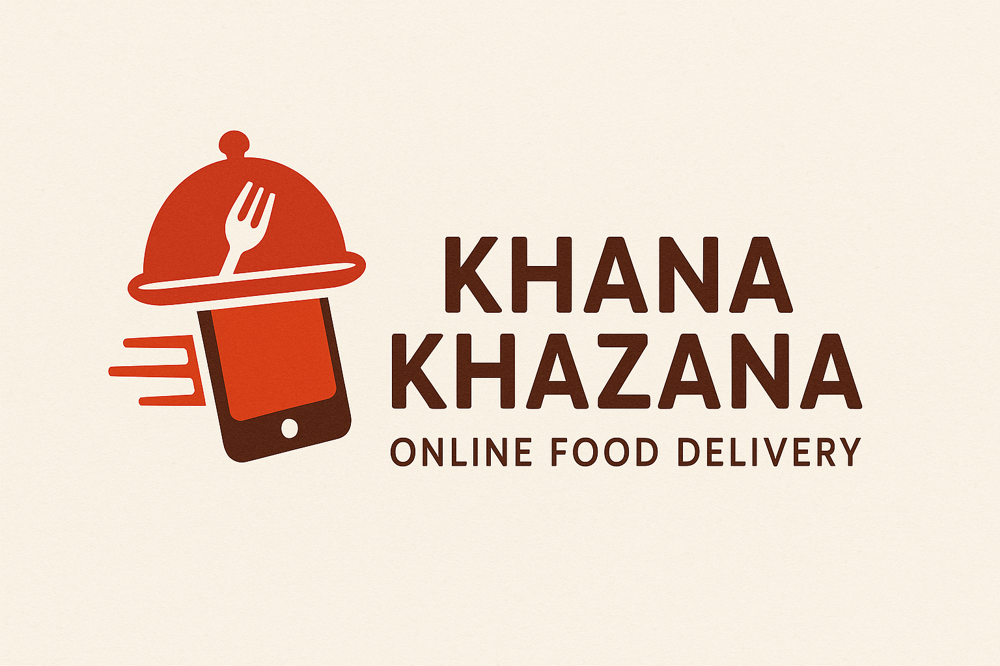
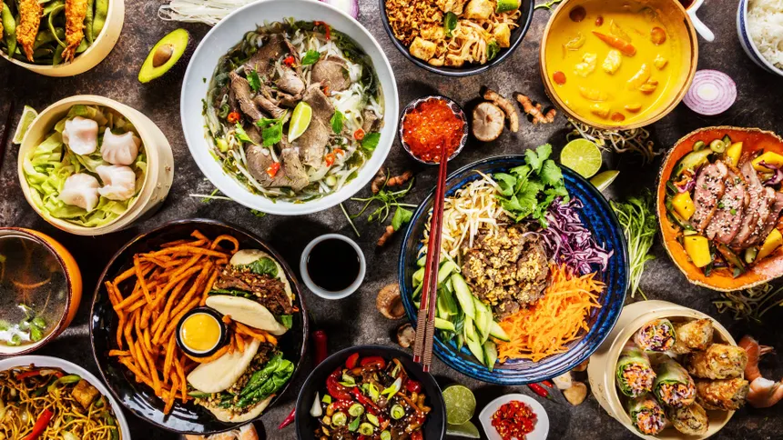

# 🍽️ Khana Khazana – Online Food Delivery Website

Welcome to **Khana Khazana**, a dynamic and visually appealing online food delivery web application designed and developed by **Gaurav Shukla**.

This project replicates the look and feel of professional food delivery platforms while focusing on user-friendly design, responsive layout, and interactive features. Built using HTML, CSS, and JavaScript, this is a front-end prototype of a full-stack food ordering service.

---

## 📸 Preview

### 🖼️ Banner & Home Page


### 🔎 Landing Page Preview


### 📝 Signup Form


---

## 🚀 Features

- 🍜 Responsive food-themed landing page
- 🧭 Navigation bar with login/signup, add restaurant, and investor relations links
- 🔍 Search bar for dish or restaurant
- 👨‍🍳 Sign-up form with input validation
- 📱 Clean and minimal UI for both desktop and mobile views
- 🎨 CSS animations and styling for user interaction
- 🔒 Separate login and thank-you pages
- 📁 Organized modular structure with dedicated CSS & JS files

---

## 🧰 Tech Stack

| Technology | Role                |
|------------|---------------------|
| HTML       | Structure           |
| CSS        | Styling & Layout    |
| JavaScript | Animations/Interaction |

---

## 📂 Project Structure

```bash
khana_khazana_website/
│
├── index_main.html          # Main landing page
├── form_new.html            # Signup form page
├── script.js                # Animations and JS interactions
├── style.css                # Styling for main page
├── login_page.css           # Login form styling
├── thankyou_page.css        # Thank you screen styling
├── banner.png               # Banner & logo
├── img.png                  # Background image
└── README.md                # This file
